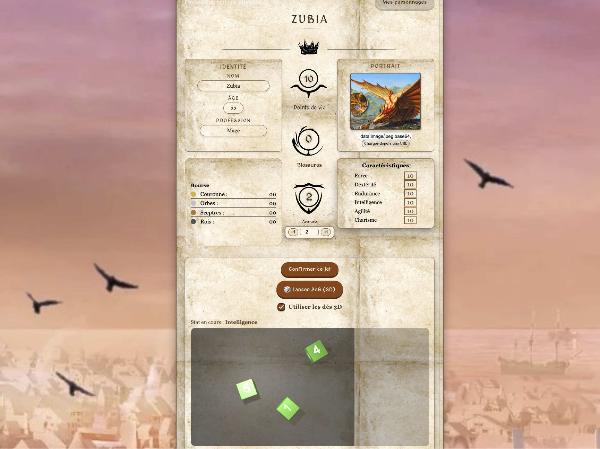
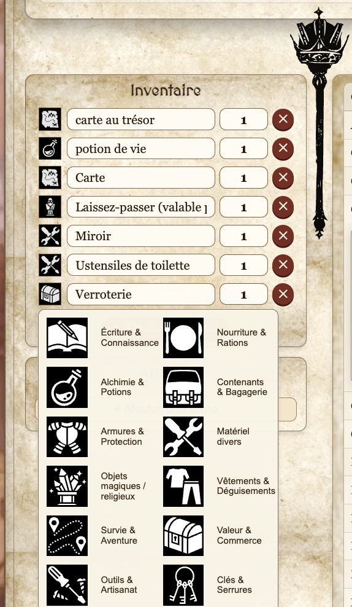
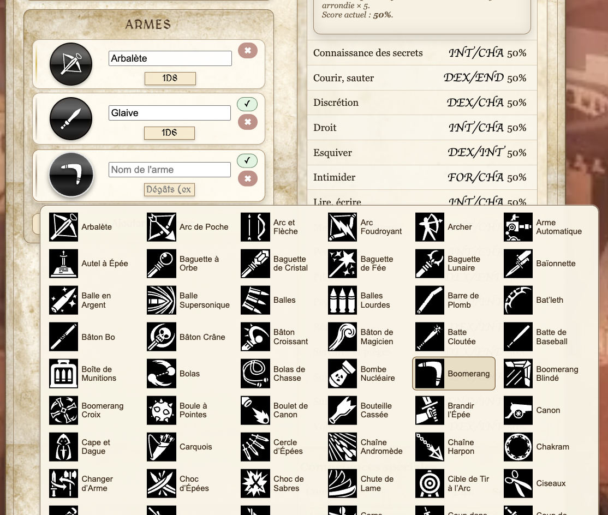
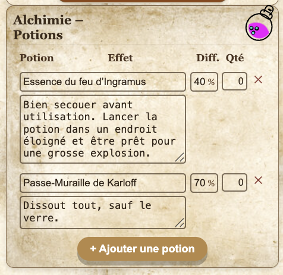
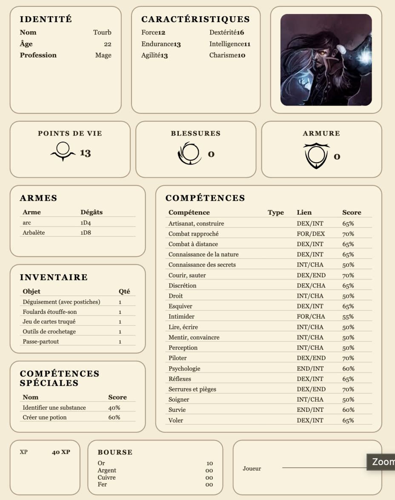

# 🛡️ ARIA – Web Character Sheet

Application web pour créer, gérer et exporter des fiches de personnage pour le jeu de rôle **ARIA**.  
Interface moderne, logique métier complète, pensée pour un usage réel en table de jeu.

👉 Projet personnel **frontend React** – UX, règles de jeu, export PDF.

---

## ✨ Features

<<<<<<< HEAD
- 🎲 Génération des caractéristiques (3d6 ou point-buy)
- 🎒 Inventaire & kits d’équipement intelligents
- ⚔️ Weapon list dédiée (armes ≠ inventaire)
- ⚗️ Alchimie optionnelle (potions & compétences)
=======
- 🎲 Génération des caractéristique
- 🎒 Inventaire 
- ⚔️ Weapon list dédiée 
- ⚗️ Alchimie 
>>>>>>> fa15a8e0e257f87fee0adf9da99a7afedd574e49
- 💾 Sauvegarde locale & serveur
- 📄 Export PDF fidèle à la fiche officielle
- 🎲 Dés en 3D (desktop & mobile)

---

## 📸 Aperçu

### Création de personnage & jets de dés

> Choix des modes de jeu, jets de dés en 3D et génération des caractéristiques.

---

### Inventaire & kits d’équipement

> Inventaire dynamique + kits avec logique métier (armes placées automatiquement).

---

### Weapon List

> Gestion dédiée des armes : icône, dégâts, validation.

---

### Alchimie

> Système d’alchimie activable : potions, effets, difficulté.

---

### Export PDF

> Export PDF prêt à être imprimé.

---

## 🛠️ Stack

- React (Vite)
- CSS custom
- jsPDF / html2canvas
- Backend REST
- Déployé sur Netlify

---

## 🙏 Crédits

- Icônes : https://game-icons.net  
- Dés 3D : https://github.com/sarahRosannaBusch/dice

---

**Auteur : Zuber**  

