# 🛡️ ARIA – Fiche de personnage interactive

<div align="center">

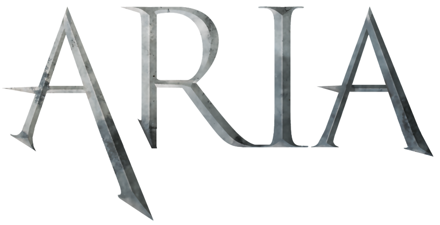

**Application web pour créer, gérer et exporter des fiches de personnage pour le jeu de rôle ARIA**

[](https://reactjs.org/)
[](https://vitejs.dev/)
[](LICENSE)

[Demo](https://your-demo-url.netlify.app) • [Report Bug](https://github.com/broduoliviercontact-web/test-aria/issues) • [Request Feature](https://github.com/broduoliviercontact-web/test-aria/issues)

</div>

---

## 📋 Table des matières

- [À propos](#-à-propos)
- [Fonctionnalités](#-fonctionnalités)
- [Aperçu](#-aperçu)
- [Technologies](#-technologies)
- [Installation](#-installation)
- [Utilisation](#-utilisation)
- [Architecture](#-architecture)
- [Roadmap](#-roadmap)
- [Contribution](#-contribution)
- [Crédits](#-crédits)
- [License](#-license)

---

## 🎯 À propos

**ARIA Character Sheet** est une application web moderne et complète dédiée à la création et gestion de personnages pour le jeu de rôle **ARIA** (créé par [FibreTigre](https://www.fibretigre.com/) et édité par [ElderCraft](https://elder-craft.com/)).

Ce projet personnel met l'accent sur :  
- ✨ Une **UX/UI soignée** inspirée des cartes à collectionner
- 🎲 L'implémentation **fidèle des règles** du jeu
- 📱 Un design **responsive** (mobile & desktop)
- 📄 Un **export PDF** prêt à imprimer

> **Note :** Ce projet n'est pas affilié officiellement à FibreTigre ou ElderCraft.  Il s'agit d'un outil communautaire créé par un passionné. 

---

## ✨ Fonctionnalités

### 🧙 Création de personnage

#### Génération des caractéristiques
- 🎲 **Mode 3d6** :  Lancez les dés en 3D , choisissez la meilleure
- 📊 **Répartition de points** : 60 points à répartir 


#### Compétences
- 🎯 **Mode Prêt à jouer** : Calcul automatique (moyenne des caracs × 5)
- 🎨 **Mode Personnalisation** : Base calculée + 50 points bonus à répartir
- 📈 Support des planchers de compétences (magiciens, types spéciaux)
- 🎲 Test de compétences intégré (d100, critique 01-09, fumble 91-00)

#### Identité & profil
- 🖼️ Portrait personnalisable (upload image)
- 👤 Nom, joueur, âge, profession
- 💭 Phrases de synthèse (génial / société)
- 🏆 Système d'expérience (XP)

---

### ⚔️ Équipement & combat

#### Inventaire intelligent
- 📦 Gestion dynamique des objets (nom, quantité)
- 🎒 **Kits d'équipement** pré-configurés :  
  - Aventurier (arme + équipement de base)
  - Combattant (choix armes :  2×1 main ou 1×2 mains)
  - Érudit (choix :  5 fioles ou 1 sablier)
- 🏷️ Distinction objets de kit vs.  personnels

#### Armes
- ⚔️ Liste dédiée séparée de l'inventaire
- 🎨 Sélection d'icône parmi 20+ armes (épées, haches, arcs…)
- 💥 Champ dégâts personnalisable
- ✅ Validation par arme (lock édition)

#### Combat
- ❤️ Points de vie (calculés depuis Endurance, cap 14)
- 🩹 Blessures
- 🛡️ Armure

---

### ⚗️ Alchimie

Système optionnel activable :
- 🧪 Gestion des potions (nom, composants, effet, difficulté, quantité)
- 📜 **Compétences auto-ajoutées** :  
  - *Identifier une substance* (60%)
  - *Créer une potion* (100%)
- 🎨 UI immersive (icône fiole animée)
- 🔒 2 potions de base pré-remplies (verrouillées) :  
  - Essence du feu d'Ingramus
  - Passe-Muraille de Karloff

---

### 🔮 Magie (système de cartes)

Système de magie complet basé sur les cartes à jouer :  

#### Types de magiciens
- 🌀 **Outsider** : 53 cartes (52 + joker)
- 🎓 **Académie** : 26 cartes + joker
  - Compétences imposées :  *Connaissance des secrets* ≥60%, *Lire/écrire* ≥80%
  - Compétence spéciale : *Modélisation* (60%)
- ⚔️ **Miséricordieux** : 11 cartes + joker
  - Compétences imposées :  *Connaissance secrets* ≥60%, *Lire/écrire* ≥80%, *Voler* ≥30%, *Combat rapproché* ≥60%
  - Compétences spéciales : *Modélisation* (80%), *Voler la magie* (30%)

#### Fonctionnalités
- 🃏 Deck mélangé (Fisher-Yates shuffle)
- 🎲 Tirage de carte
- ♻️ Gestion défausse / cartes utilisées
- 📊 Compteur de cartes restantes
- 🔄 Reset du deck
- 🔐 Validation du type (lock compétences)

---

### 💾 Sauvegarde & partage

- 📁 **Local** : localStorage (navigation sans compte)
- ☁️ **Serveur** : Authentification + API REST (CRUD complet)
- 📄 **Export PDF** : 
  - Rendu fidèle à la fiche officielle ARIA
  - html2canvas + jsPDF
  - Mise en page A4 optimisée
  - Prêt à imprimer

---

### 🎲 Dés 3D interactifs

- 🎮 Rendu 3D réaliste (bibliothèque Three.js)
- 🎨 Modes de couleur (solid / gradient)
- 📱 Compatible mobile & desktop
- ⚡ Jet de dés animé (physique réaliste)
- 🎯 Intégré dans :  
  - Génération des caractéristiques (3d6)
  - Tests de compétences (d100)

---

### 📚 Personnages du livre

- 🃏 Galerie de cartes interactive (hover flip effect)
- 📖 **Personnages pré-configurés** du livre ARIA
- 🖊️ Chargement dans l'éditeur (éditable)
- 🎨 Design "carte Pokémon" avec effet holographique

---

## 📸 Aperçu

### Home page
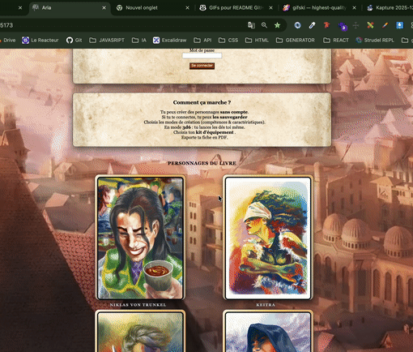
*Interface d'accueil avec galerie de personnages et authentification*

---

### Création de personnage
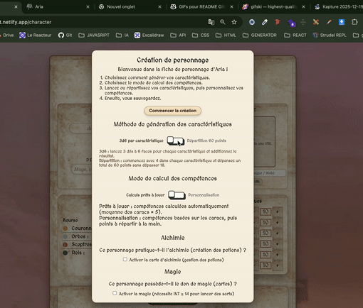
*Choix des modes de création et jets de dés 3D*

---

### Fiche complète
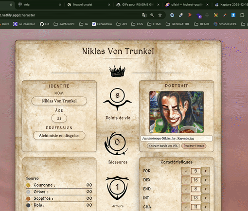
*Vue d'ensemble de la fiche :  stats, compétences, inventaire*

---


### 🎲 Dés 3D - Génération des caractéristiques
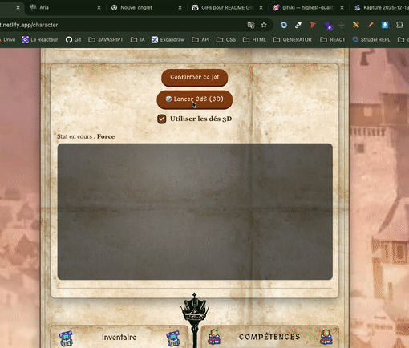
*Lancers de dés 3D pour générer les caractéristiques (3d6 par stat)*

---

### 🎲 Dés 3D - Tests de compétences (d100)
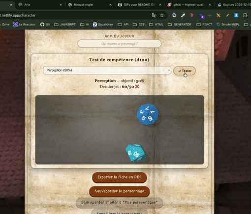
*Tests de compétences avec d100 en 3D :  critiques (01-09) et fumbles (91-00)*

---

### Fiche complète

*Vue d'ensemble de la fiche :  stats, compétences, inventaire*

---

### Inventaire & Kits d'équipement
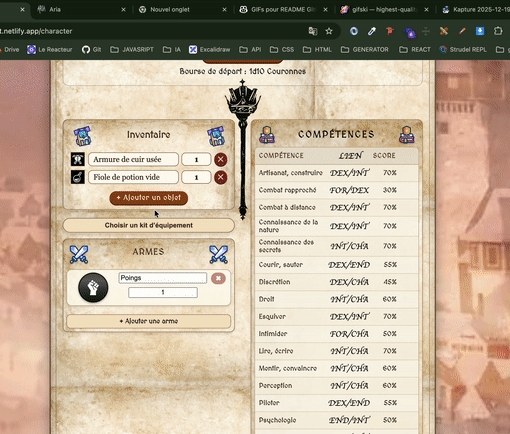
*Gestion de l'inventaire avec kits pré-configurés*

---

### Gestion des armes

*Sélection d'icônes d'armes et validation*

---

### Kit d'équipement
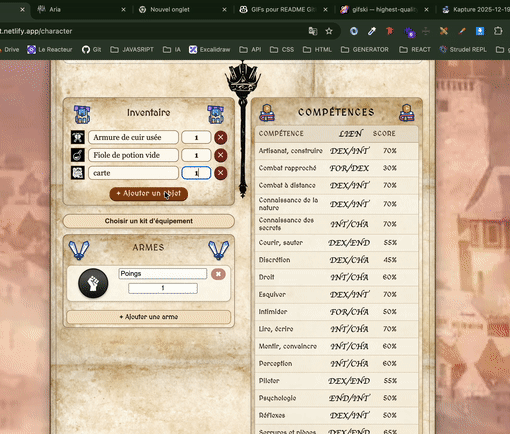
*Sélection d'armes et validation*

---

### Système d'alchimie
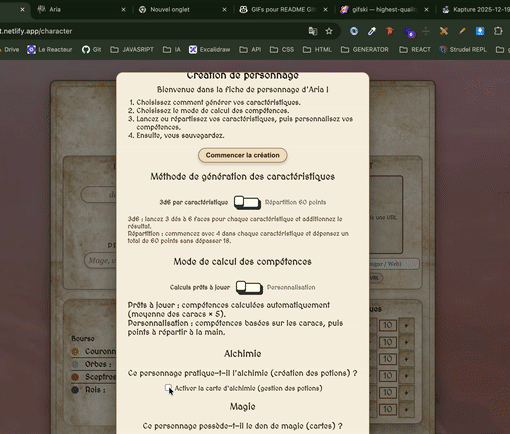
*Interface de gestion des potions alchimiques*

---

### Système de magie
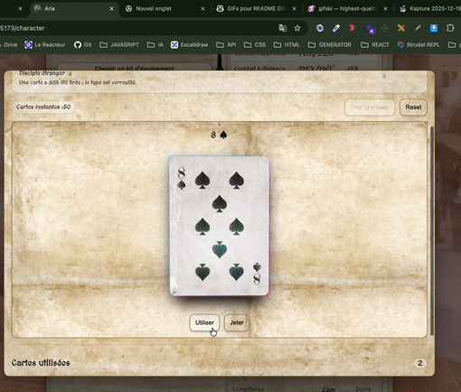
*Modal de gestion du deck de cartes magiques*

---

### Export PDF
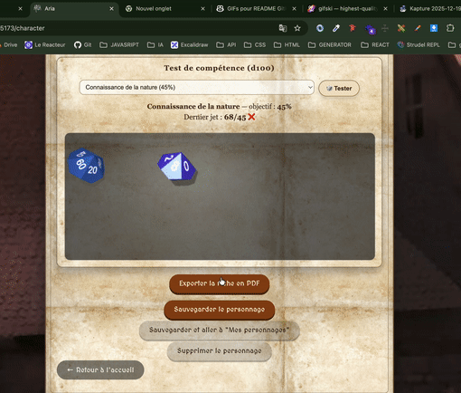
*Génération et téléchargement du PDF de la fiche*

---

## 🛠️ Technologies

### Frontend
- **React 18** (Vite)
- **React Router** (navigation SPA)
- **CSS custom** (design médiéval-fantastique)
- **Context API** (gestion état dés)

### Backend (API REST)
- **Node.js** + **Express**
- **MongoDB** (Mongoose)
- **JWT** (authentification)
- **bcrypt** (hash passwords)

### Export & rendu
- **jsPDF** (génération PDF)
- **html2canvas** (capture DOM → image)

### Dés 3D
- **Three.js** (via wrapper custom)
- **Cannon.js** (physique)

### Déploiement
- **Frontend** : Netlify
- **Backend** : (à préciser :  Railway, Render, Heroku…)

---

## 🚀 Installation

### Prérequis
- Node. js ≥ 18
- npm ou yarn

### 1. Cloner le repo

```bash
git clone https://github.com/broduoliviercontact-web/test-aria.git
cd test-aria
```

### 2. Installer les dépendances

```bash
npm install
```

### 3. Variables d'environnement

Créer un fichier `.env` à la racine :  

```env
VITE_API_URL=http://localhost:4000
```

### 4. Lancer le serveur de développement

```bash
npm run dev
```

L'application sera accessible sur `http://localhost:5173`

---

## 📖 Utilisation

### Créer un personnage

1. **Sans compte** : Cliquez sur "Créer un personnage"
2. **Avec compte** : Connectez-vous, puis "Nouveau personnage"

### Modes de création

#### Caractéristiques
- **3d6** :  Lancez jusqu'à 5 séries, sélectionnez la meilleure, validez
- **Répartition** :  Distribuez 60 points (min 0, max 18)

#### Compétences
- **Prêt à jouer** : Auto-calculées (moyenne × 5)
- **Personnalisation** : Base + 50 points bonus

### Alchimie & Magie

- Activez depuis la **modale de création**
- Pour la magie : nécessite **INT ≥ 14**

### Export PDF

1.  Complétez votre fiche
2. Cliquez sur "Exporter en PDF"
3. Le fichier `fiche-personnage-aria.pdf` se télécharge

---

## 🏗️ Architecture

```
src/
├── pages/
│   ├── HomePage.jsx          # Accueil + galerie
│   ├── CharacterPage.jsx     # Éditeur de fiche
│   └── CharactersPage.jsx    # Liste des persos sauvegardés
├── components/
│   ├── CharacterStats.jsx    # Bloc caractéristiques
│   ├── CompetenceList.jsx    # Tableau compétences + tests
│   ├── SpecialCompetences.jsx
│   ├── WeaponList.jsx        # Gestion armes
│   ├── Inventory.jsx
│   ├── AlchemyPotions.jsx
│   ├── MagicModal.jsx        # Système de cartes
│   ├── StatsDiceRoller.jsx   # Dés 3D (3d6)
│   ├── Dice3D.jsx            # Moteur de dés
│   ├── SpecialCompetenceDiceTray.jsx  # Tests d100
│   ├── BookCharacterGallery.jsx
│   └── ...  
├── data/
│   └── bookCharacters.js     # Personnages du livre
├── bladeIcons. js             # Icônes d'armes
├── App.jsx                   # Routing & state global
└── App.css                   # Styles globaux
```

### State management

- **Props drilling** pour la fiche (state dans `App.jsx`)
- **Context API** pour les jets de dés (`DiceRollContext. jsx`)
- **localStorage** :  portrait, prefill template
- **Backend** : persistance via API REST

---

## 🗺️ Roadmap

### Court terme
- [ ] 🌐 Traductions (EN, ES)
- [ ] 🎨 Thèmes de couleur (clair/sombre)
- [ ] 📊 Graphiques de progression XP
- [ ] 🔔 Notifications toast (succès/erreur)

### Moyen terme
- [ ] 👥 Partage de fiche (lien public)
- [ ] 🎲 Mode "Table de jeu" (sync temps réel)
- [ ] 📝 Notes de session
- [ ] 🧩 Compagnons / familiers

### Long terme
- [ ] 🗺️ Intégration cartes interactives
- [ ] 🎭 Gestionnaire de campagne (MJ)
- [ ] 🔌 API publique (webhooks)

---

## 🤝 Contribution

Les contributions sont les bienvenues ! Voici comment participer :

1. Fork le projet
2. Créez une branche (`git checkout -b feature/AmazingFeature`)
3. Committez (`git commit -m 'Add some AmazingFeature'`)
4. Push (`git push origin feature/AmazingFeature`)
5. Ouvrez une Pull Request

### Guidelines
- Respectez l'architecture existante
- Commentez le code (JSDoc pour les fonctions complexes)
- Testez sur mobile **et** desktop
- Vérifiez l'export PDF après modifications

---

## 🙏 Crédits

### Univers ARIA
- **Créateur** : [FibreTigre](https://www.fibretigre.com/)
- **Éditeur** : [ElderCraft](https://elder-craft.com/)

### Assets & bibliothèques
- **Icônes** : [game-icons. net](https://game-icons.net), [Flaticon](https://www.flaticon.com)
- **Style cartes** : [pokemon-cards-css](https://github.com/simeydotme/pokemon-cards-css) (Simon Goellner)
- **Dés 3D** : [dice](https://github.com/sarahRosannaBusch/dice) (Sarah Rosanna Busch)
- **Fonts** : Google Fonts (MedievalSharp, Merienda)

### Développement
- **Auteur principal** : [Zuber](https://github.com/broduoliviercontact-web)
- **Communauté** :  Merci aux joueurs d'ARIA pour leurs retours ! 

---

## 📄 License

Ce projet est sous licence **MIT**. Voir le fichier [LICENSE](LICENSE) pour plus de détails.

> ⚠️ **Disclaimer** : Les droits sur l'univers ARIA appartiennent à FibreTigre et ElderCraft. Cette application est un outil non-officiel créé par un fan, sans but commercial.

---

<div align="center">

**Fait avec ❤️ pour la communauté ARIA**

[⬆ Retour en haut](#-aria--fiche-de-personnage-interactive)

</div>