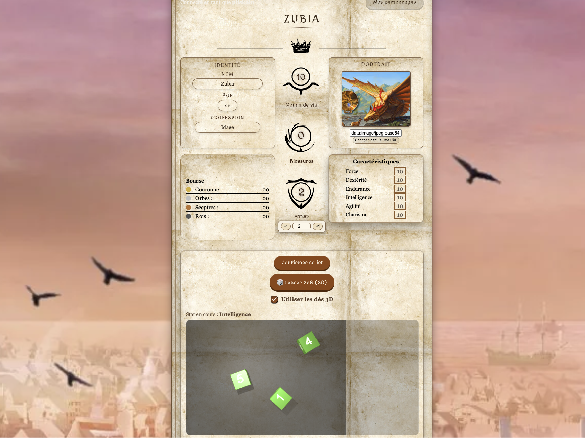
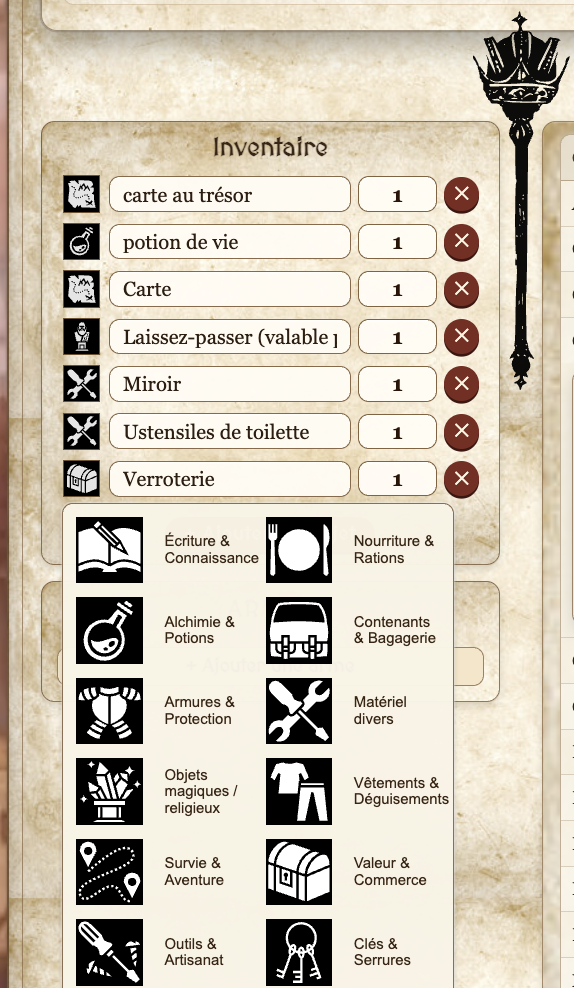
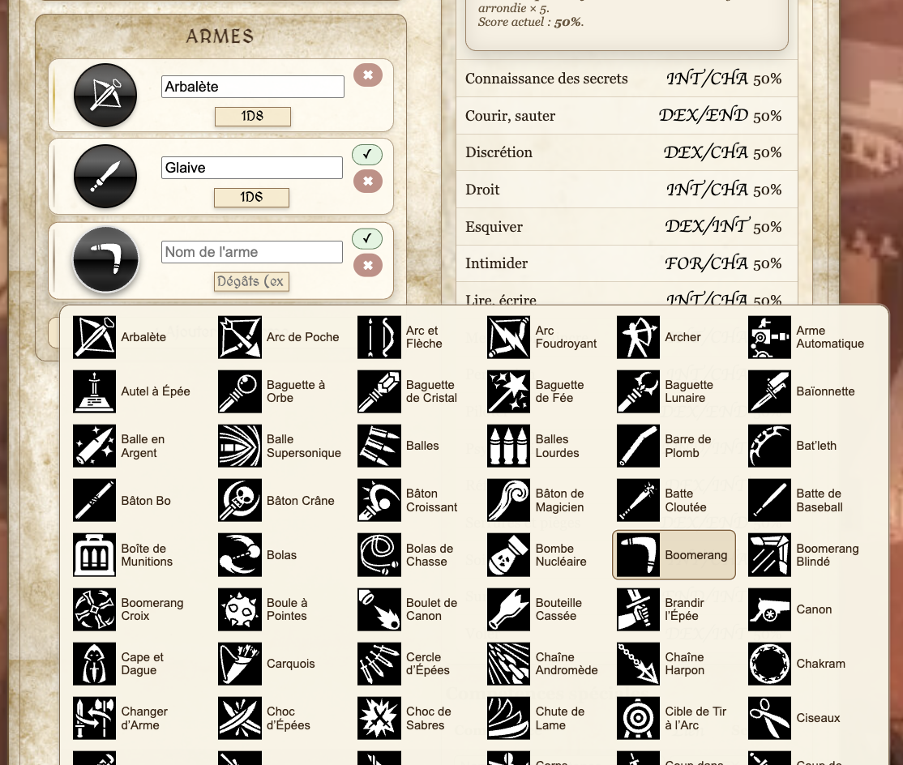
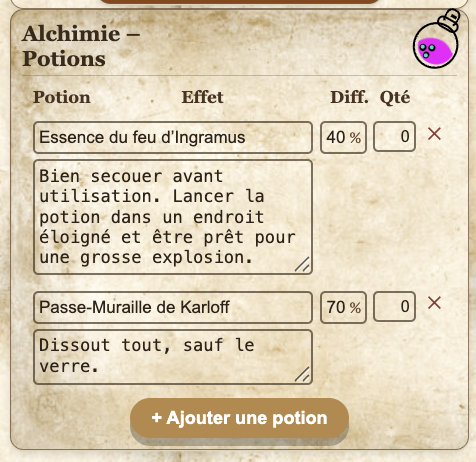
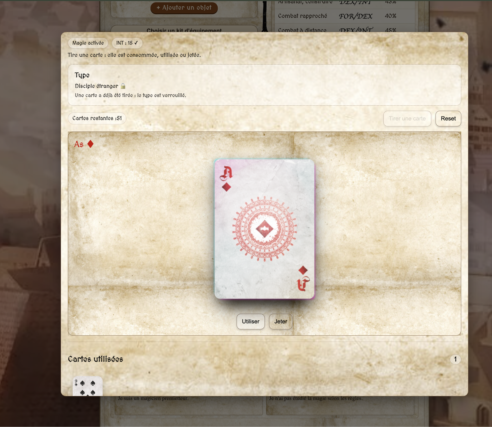
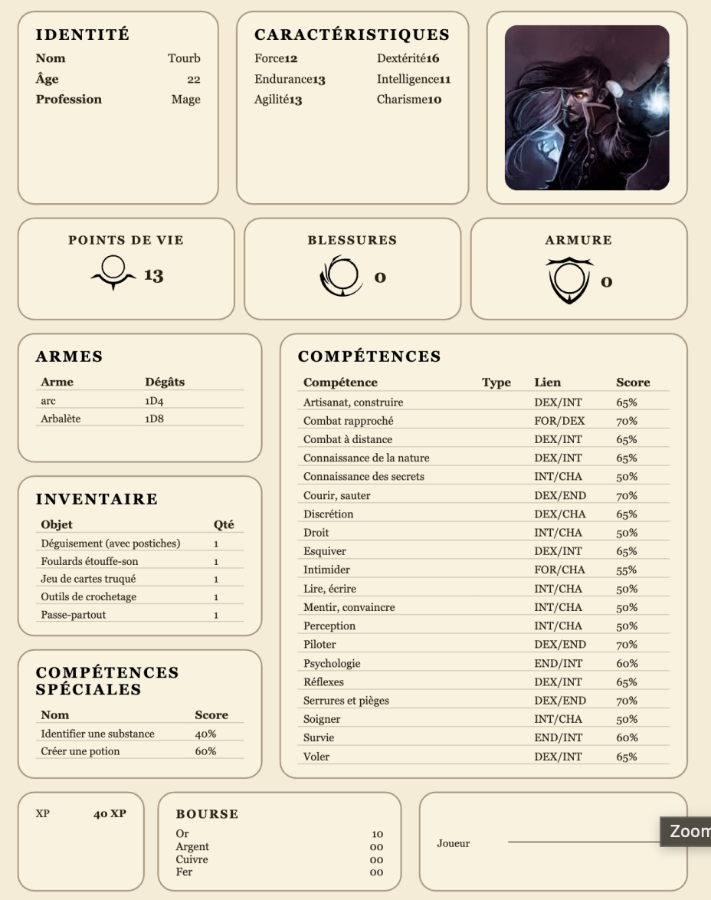

# 🛡️ ARIA – Web Character Sheet

Application web pour créer, gérer et exporter des fiches de personnage pour le jeu de rôle **ARIA**.  
Interface moderne, logique métier complète, pensée pour un usage réel en table de jeu.

👉 Projet personnel **frontend React** – UX, implémentation des règles, export PDF fidèle à la fiche officielle.

---

## ✨ Features

### 🧙 Création & règles de jeu
- 🎲 Génération des caractéristiques  
  (jets **3d6** ou **répartition de points**)
- 🧠 Calcul automatique ou personnalisé des compétences
- 🧾 Personnages du livre pré-intégrés (pré-remplissage éditable)

### 🎒 Équipement & gestion
- 🎒 Inventaire dynamique
- 🧰 Kits d’équipement intelligents  
  (logique métier, objets ajoutés automatiquement)
- ⚔️ Weapon list dédiée  
  (armes séparées de l’inventaire, icônes, dégâts, validation)

### ⚗️ Alchimie
- Activation optionnelle de l’alchimie
- Potions, effets, quantités et difficulté
- Compétences spéciales automatiquement ajoutées

### 🔮 Magie (système de cartes)
- Activation du don de magie (INT ≥ 14)
- Choix du **type de magicien** :
  - Outsider
  - Académie
  - Miséricordieux
- Deck de cartes personnalisé (taille, joker)
- Tirage, défausse et cartes utilisées
- Compétences magiques imposées selon le type
- Modal dédiée à la magie

### 💾 Sauvegarde & export
- 💾 Sauvegarde locale
- ☁️ Sauvegarde serveur (compte utilisateur)
- 📄 Export PDF fidèle à la fiche officielle ARIA
- 🎲 Dés en 3D (desktop & mobile)

---

## 📸 Aperçu

### Création de personnage & jets de dés
  
> Choix des modes de création, jets de dés en 3D et génération des caractéristiques.

---

### Inventaire & kits d’équipement
  
> Inventaire dynamique avec logique métier (kits, placement automatique des armes).

---

### Weapon List
  
> Gestion dédiée des armes : icône, dégâts, validation.

---

### Alchimie
  
> Système d’alchimie activable : potions, effets et difficulté.

---

### Magie
  
> Système de magie par cartes : type de mage, tirage, gestion du deck.

---

### Export PDF
  
> Export PDF prêt à être imprimé ou partagé.

---

## 🛠️ Stack technique

- React (Vite)
- CSS custom
- jsPDF / html2canvas
- Backend REST (auth & persistance)
- Déploiement : Netlify

---

## 🙏 Crédits

- Icônes (armes, UI, symboles) :  
  - https://game-icons.net  
  - https://www.flaticon.com
- Dés 3D :  
  - https://github.com/sarahRosannaBusch/dice
- Univers & jeu **ARIA** :  
  - FibreTigre (créateur) https://www.fibretigre.com/
  - ElderCraft (éditeur)  https://elder-craft.com/

---

**Auteur : Zuber**
